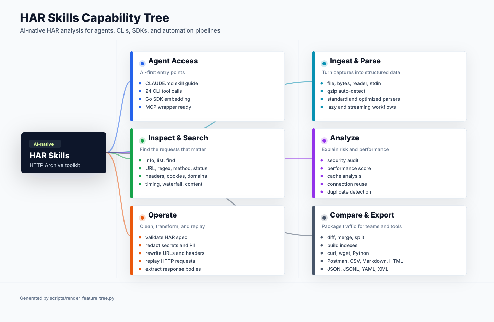

# HAR Skills

[](https://pkg.go.dev/github.com/hitechcloud-vietnam/har-skills)
[](https://goreportcard.com/report/github.com/hitechcloud-vietnam/har-skills)
[](https://github.com/hitechcloud-vietnam/har-skills/blob/main/LICENSE)
[](https://github.com/hitechcloud-vietnam/har-skills/releases/latest)
[](https://github.com/hitechcloud-vietnam/har-skills/actions)

**HAR Skills is an AI-native HAR (HTTP Archive) analysis toolkit.**

It is designed for AI agents first, then exposed as a Go SDK and CLI. An agent can install one binary, inspect a HAR file, search traffic, audit security issues, score performance, redact secrets, replay requests, transform captures, diff versions, and export results in machine-readable formats.

## AI Agent First

HAR files are dense, noisy, and easy to mishandle in chat context. HAR Skills turns them into tool calls that agents can safely compose:

- **Skill document**: [CLAUDE.md](./CLAUDE.md) is a progressive-disclosure guide written for AI agents.
- **CLI tool surface**: `har` exposes 24 commands with text, JSON, CSV, and YAML output where supported.
- **Go SDK surface**: the root package can be embedded into custom agent tools, workers, CI jobs, and MCP servers.
- **Automation-safe behavior**: typed errors, nil-safe public APIs, streaming/lazy parsing, redaction, validation, and deterministic export helpers.
- **MCP-ready direction**: the current CLI and SDK are structured so an MCP server can wrap the same capabilities without inventing a second API.

### One-Prompt Agent Bootstrap

Give this to an AI agent when you want it to analyze HAR files with this project:

```text
You can use HAR Skills, an AI-native HAR (HTTP Archive) analysis toolkit.

Install:
  go install github.com/hitechcloud-vietnam/har-skills/cmd/har@latest

Core usage:
  har -f <capture.har> <command> [flags]
  cat capture.har | har <command>
  har -f capture.har <command> --format json

Start with:
  har -f capture.har info --format json
  har -f capture.har security --format json
  har -f capture.har performance --format json
  har -f capture.har find --errors --format json
  har -f capture.har find --slow 1000 --format json
  har -f capture.har redact -o clean.har

Full agent skill docs:
  https://github.com/hitechcloud-vietnam/har-skills/blob/main/CLAUDE.md
```

## Capability Tree

<p align="center">
  
</p>

The diagram is generated by [`scripts/render_feature_tree.py`](./scripts/render_feature_tree.py), so capability changes can be reviewed as code and re-rendered deterministically.

## Access Methods

| Access | Status | Best For | Entry Point |
|--------|--------|----------|-------------|
| **AI Agent Skill** | Ready | Claude, ChatGPT, coding agents, local automation | [CLAUDE.md](./CLAUDE.md) + `har` CLI |
| **CLI** | Ready | Terminal, shell scripts, CI, agent tool execution | `go install github.com/hitechcloud-vietnam/har-skills/cmd/har@latest` |
| **Go SDK** | Ready | Native Go apps and custom agent tool servers | `go get github.com/hitechcloud-vietnam/har-skills` |
| **MCP** | Planned | MCP-compatible desktops and IDE agents | Wrap the SDK/CLI today; built-in server planned |

## What Agents Can Do

| Task | Recommended Tool Call |
|------|------------------------|
| Understand a HAR file | `har -f capture.har info --format json` |
| Find failing requests | `har -f capture.har find --errors --format json` |
| Find slow requests | `har -f capture.har find --slow 1000 --format json` |
| Inspect security posture | `har -f capture.har security --format json` |
| Score frontend/network performance | `har -f capture.har performance --format json` |
| Remove secrets before sharing | `har -f capture.har redact -o clean.har` |
| Compare before/after captures | `har diff before.har after.har --format json` |
| Export reproduction commands | `har -f capture.har export curl` |
| Replay captured traffic | `har -f capture.har replay --timeout 10s` |
| Validate malformed captures | `har -f capture.har validate --format json` |

## Install

### Go Install

```bash
go install github.com/hitechcloud-vietnam/har-skills/cmd/har@latest
har --version
```

### Prebuilt Binary

Download the latest build from [GitHub Releases](https://github.com/hitechcloud-vietnam/har-skills/releases/latest).

Supported release targets include Linux, macOS, Windows, and FreeBSD on common x86 and ARM architectures.

### Build From Source

```bash
git clone https://github.com/hitechcloud-vietnam/har-skills.git
cd har-skills
go build -o har ./cmd/har/
./har --help
```

## CLI Quick Start

```bash
har -f capture.har info                              # Overview
har -f capture.har list --limit 20                   # List entries
har -f capture.har find "api/users"                  # Search URL text
har -f capture.har find --errors                     # 4xx/5xx requests
har -f capture.har find --slow 1000                  # Requests slower than 1s
har -f capture.har find --response-header "X-Debug"  # Response header search
har -f capture.har headers --response --name server  # Inspect headers
har -f capture.har timing --summary                  # Timing breakdown
har -f capture.har waterfall                         # Request timeline
har -f capture.har security                          # Security audit
har -f capture.har performance                       # Performance score
har -f capture.har cache                             # Cacheability analysis
har -f capture.har cookie                            # Cookie security analysis
har -f capture.har connections                       # Connection reuse analysis
har -f capture.har content                           # Content type and size analysis
har -f capture.har extract --index 0 -o body.bin     # Extract response body
har -f capture.har redact -o clean.har               # Redact sensitive data
har -f capture.har transform --help                  # Rewrite URLs, headers, schemes
har -f capture.har export curl                       # Export as cURL commands
har -f capture.har export postman -o collection.json # Export Postman collection
har diff before.har after.har                        # Compare captures
har merge a.har b.har -o merged.har                  # Merge captures
har -f capture.har split --by domain                 # Split captures
har -f capture.har dedup --remove -o dedup.har       # Remove duplicate requests
har -f capture.har index --pattern "api"             # Build/query index
har -f capture.har validate                          # Validate HAR spec
har -f capture.har replay                            # Replay HTTP requests
```

## Command Reference

| Command | Capability |
|---------|------------|
| `info` | File overview, request counts, status codes, domains, content types |
| `list` | Entry listing with filters, sorting, and limits |
| `find` | Search by URL, regex, status, method, domain, headers, cookies, size, speed |
| `headers` | Request/response header inspection |
| `timing` | DNS/connect/SSL/send/wait/receive timing analysis |
| `waterfall` | Timeline and waterfall-style request sequencing |
| `extract` | Response body extraction and decoding |
| `content` | MIME type, body size, and content distribution analysis |
| `domains` | Per-domain request and timing statistics |
| `connections` | Connection reuse analysis |
| `security` | Security audit for headers, cookies, CORS, mixed content, leakage |
| `cookie` | Cookie inventory and security posture |
| `cache` | Cache-Control and cacheability analysis |
| `performance` | Lighthouse-style scoring and recommendations |
| `redact` | Sensitive data redaction for passwords, tokens, API keys, IPs |
| `transform` | URL, host, scheme, header, query, cookie, and body transformations |
| `replay` | Re-execute captured HTTP requests |
| `validate` | HAR format and strict validation |
| `diff` | Compare two HAR files |
| `merge` | Merge multiple HAR files |
| `split` | Split by domain, page, time, size, status, or method |
| `dedup` | Detect and remove duplicate or near-duplicate requests |
| `index` | Build an in-memory index for fast lookup |
| `export` | Export to curl, wget, Python, Postman, CSV, Markdown, HTML, JSON, JSONL, YAML, XML |

## Go SDK

```go
package main

import (
	"fmt"
	"log"

	har "github.com/hitechcloud-vietnam/har-skills"
)

func main() {
	h, err := har.ParseHarFile("capture.har")
	if err != nil {
		log.Fatal(err)
	}

	stats := h.Statistics()
	fmt.Printf("requests=%d avg=%.1fms\n", stats.TotalRequests, stats.AvgTime)

	security := h.SecurityAudit()
	fmt.Printf("security=%d/100\n", security.Score)

	perf := h.PerformanceScore()
	fmt.Printf("performance=%s %.1f/100\n", perf.Grade(), perf.OverallScore)

	redacted := h.Redact(har.DefaultRedactOptions())
	if err := redacted.SaveToFile("clean.har", true); err != nil {
		log.Fatal(err)
	}
}
```

## SDK Capability Areas

- **Parsing**: files, bytes, readers, gzip-compressed input, stdin-friendly workflows.
- **Large files**: standard, optimized, lazy, and streaming parsing models.
- **Creation**: build HAR files programmatically and save formatted JSON.
- **Search/filter**: methods, status codes, domains, content types, URL patterns, timing, size.
- **Statistics**: global summaries, timing percentiles, domains, status codes, content distribution.
- **Security**: headers, cookies, CORS, mixed content, sensitive data exposure.
- **Performance**: TTFB, total load time, request count, transfer size, cache, compression.
- **Privacy**: redaction of credentials, tokens, API keys, cookies, headers, IP addresses.
- **Operations**: validate, transform, replay, extract, deduplicate, index.
- **Interop**: diff, merge, split, export to common developer and report formats.

## Project Layout

```text
.
├── *.go                 # Root Go SDK package
├── cmd/har/             # Cobra CLI used by humans and agents
├── CLAUDE.md            # Progressive AI Agent Skill documentation
├── docs/assets/         # Generated README diagrams and static assets
├── scripts/             # Documentation generation helpers
├── examples/            # SDK examples
├── testdata/            # HAR fixtures
└── doc/                 # Additional human documentation
```

## For Agent Tool Authors

If you are wrapping HAR Skills for another agent runtime:

1. Use the CLI first when you need a stable process boundary.
2. Prefer `--format json` for model-readable outputs.
3. Run `redact` before sending HAR-derived content to external systems.
4. Use `validate` before deeper analysis when the capture source is unknown.
5. Use the Go SDK when you need long-running workers, custom filters, or embedded policy.

## Contributing

Contributions are welcome. Please read [CONTRIBUTING.md](CONTRIBUTING.md) for guidelines.

## License

[MIT License](LICENSE)

---

## Simplified Chinese

**HAR Skills is an AI-native toolkit for analyzing HAR (HTTP Archive) files.**

It is designed for AI agents first, with a CLI and Go SDK. Using the `har` command, an agent can parse and search HAR files, audit security, score performance, redact sensitive data, replay and transform requests, compare captures, merge and split files, and export to multiple formats.

### AI Agent Access Methods

| Access Method | Status | Best For | Entry Point |
|----------|------|----------|------|
| **AI Agent Skill** | Available | Claude, ChatGPT, coding agents, local automation | [CLAUDE.md](./CLAUDE.md) + `har` CLI |
| **CLI** | Available | Terminals, scripts, CI, agent tool calls | `go install github.com/hitechcloud-vietnam/har-skills/cmd/har@latest` |
| **Go SDK** | Available | Go applications, custom agent tool servers | `go get github.com/hitechcloud-vietnam/har-skills` |
| **MCP** | Planned | MCP-compatible desktop and IDE agents | Wrap the CLI/SDK for now |

### One-Prompt Agent Bootstrap

```text
You can use HAR Skills to analyze HAR (HTTP Archive) files.

Install:
  go install github.com/hitechcloud-vietnam/har-skills/cmd/har@latest

Basic usage:
  har -f <capture.har> <command> [flags]
  cat capture.har | har <command>
  har -f capture.har <command> --format json

Start with these commands:
  har -f capture.har info --format json
  har -f capture.har security --format json
  har -f capture.har performance --format json
  har -f capture.har find --errors --format json
  har -f capture.har find --slow 1000 --format json
  har -f capture.har redact -o clean.har

Full skill documentation:
  https://github.com/hitechcloud-vietnam/har-skills/blob/main/CLAUDE.md
```

### Capabilities

- **Ingest and parse**: files, bytes, readers, stdin, gzip, standard, optimized, lazy, and streaming parsers.
- **Search and inspect**: summaries, listings, URL/regex searches, status codes, headers, cookies, domains, timings, and waterfalls.
- **Security and privacy**: security headers, cookie security, CORS, mixed content, sensitive data exposure, and redaction.
- **Performance analysis**: TTFB, total load time, request count, transfer size, caching, compression, and optimization recommendations.
- **Operations and remediation**: validation, URL/header/scheme transforms, request replay, response extraction, deduplication, and indexing.
- **Collaboration and export**: diff, merge, split, and export to curl, wget, Python, Postman, CSV, Markdown, HTML, JSON, JSONL, YAML, and XML.

### Common Commands

```bash
har -f capture.har info --format json          # File summary
har -f capture.har find --errors --format json # Failed requests
har -f capture.har find --slow 1000            # Slow requests
har -f capture.har security                    # Security audit
har -f capture.har performance                 # Performance score
har -f capture.har redact -o clean.har         # Redact sensitive data
har -f capture.har export curl                 # Export reproduction commands
har diff before.har after.har                  # Compare two HAR files
har merge a.har b.har -o merged.har            # Merge HAR files
har -f capture.har validate                    # Validate against the specification
```

### Go SDK Example

```go
import har "github.com/hitechcloud-vietnam/har-skills"

h, err := har.ParseHarFile("capture.har")
if err != nil {
	panic(err)
}

stats := h.Statistics()
security := h.SecurityAudit()
performance := h.PerformanceScore()

_, _, _ = stats, security, performance
```
